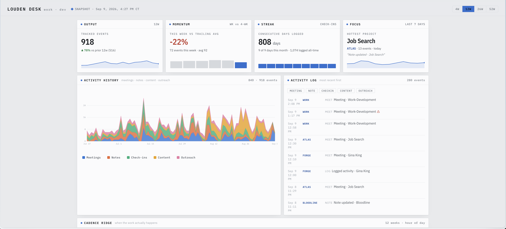

# Louden Desk

A mission-control dashboard for one person's work, built out of an Obsidian vault.

**[→ Open the live dashboard](https://rayadamas.github.io/louden-desk)**

It started as a joke. A Bloomberg-terminal pastiche where a swarm of AI agents with city codenames
runs a crypto strategy. The joke is the over-engineering. The information
design underneath it is genuinely good: one glance for status, then each panel is a different
analytical lens on the same underlying activity.

So I kept the structure and threw out the fake data. Every panel here is driven by what I
actually did - meetings, notes, daily check-ins, posts, outreach - mined from my own vault.



## This is a snapshot, not a live dashboard

Worth being explicit, because the design implies otherwise:

**Nothing here connects to anything.** `dashboard-data.json` is a frozen file. The page reads
it and draws. There is no API, no polling, no backend, and the only outbound request the page
makes is to Google Fonts for the typeface. Clone this in 2030 and it still shows September 2026.

The `4W / 12W / 26W / 52W` selector slices *within* the frozen snapshot - it looks backward
from the snapshot date, never forward. The header states the as-of timestamp for exactly this
reason.

If you want it to show a different week, you regenerate it (see below). It will not do that
on its own.

## Looking at it

**Live:** https://rayadamas.github.io/louden-desk

**Locally:** clone and open `index.html`. That's it - the data is baked into the file, so it
works by double-click, offline, no server and no install.

`dashboard.html` is the same page reading `dashboard-data.json` as a separate file. Browsers
block that over `file://`, so it needs a server:

```bash
python3 -m http.server 4173   # then open http://localhost:4173/dashboard.html
```

Use that one if you're regenerating data and want to refresh without rebuilding the inline copy.

## What the panels do

| Panel | Question it answers |
|---|---|
| **Output / Momentum / Streak / Focus** | the glance row - how much, trending which way, how consistent, on what |
| **Activity History** | the shape of the window, stacked by source |
| **Activity Log** | reverse-chron feed, filterable by source or project |
| **Cadence Ridge** | what hour of day the work actually happens, week over week |
| **Project Flow** | which projects share a day - a context-switching map |
| **Domain Balance** | share of attention across life areas vs. the window before |
| **Knowledge Graph** | which notes link to or share tags with each other, clustered by project |
| **Project Roster** | every tracked project - status, last touch, 12-week sparkline |

Clicking a roster card or the Focus tile filters the log and highlights that project across
Flow and the Graph. Everything has a hover tooltip with the underlying numbers.

## How it's built

Three files, zero dependencies, no build step.

```
build-dashboard.mjs   walks the vault, classifies every event to a project, computes
                      every metric + time series + a precomputed graph layout
                      → dashboard-data.json

merge-external.mjs    folds in numbers that don't live on disk (post counts and
                      impressions from Buffer, sent-mail volume from Gmail)
                      → external-data.json, merged into dashboard-data.json

dashboard.html        renderer - vanilla JS, hand-rolled inline SVG, no chart library

taxonomy.config.mjs   who and what the vault is about - projects, people, filters
                      (git-ignored; taxonomy.example.mjs is the committed version)
```

The interesting part is the classifier. Every event - a meeting note's frontmatter timestamp,
a file's mtime, a bullet in a daily check-in - gets routed to one of ten projects by an
ordered set of rules: title patterns first, then folder paths, then known people, then body
keywords, then a domain-level fallback. Bulk-edit days are capped so a vault reorganisation
doesn't read as a heroic work day, and daily-note sections like dream logs and morning routine
are filtered out before anything is counted.

The force-directed graph layout is computed in Node and shipped as coordinates, so the browser
draws static SVG - no simulation, no D3, nothing to load.

## Regenerating it

The build script reads a **specific Obsidian vault** with a specific folder structure. It
refuses to run if it can't find one, so cloning this repo and running it does nothing harmful.

Who and what a vault is about lives in `taxonomy.config.mjs`, which is git-ignored - a real one
names real people and real folders. `taxonomy.example.mjs` is the committed, genericised version
and the only file you'd need to edit:

```bash
cp taxonomy.example.mjs taxonomy.config.mjs        # then describe your own projects
node build-dashboard.mjs --vault=/path/to/vault    # → dashboard-data.json
node merge-external.mjs                            # optional, folds in external numbers
node build-dashboard.mjs --inline                  # bakes it into index.html
```

Add `--redact` to generalise free-text labels (see below).

## A note on the data

The numbers, charts, cadence, streak, roster stats and graph structure are all real and
unmodified. The free-text labels in the Activity Log and Knowledge Graph are generalised -
"Meeting · Job Search" rather than the actual note title - because the real ones name
recruiters, coaching contacts and people I work with, and they didn't sign up to be in a
public repo. That's the `--redact` flag; my local copy runs without it.

## License

MIT - see [LICENSE](LICENSE). The code is yours to take. The data is mine.
